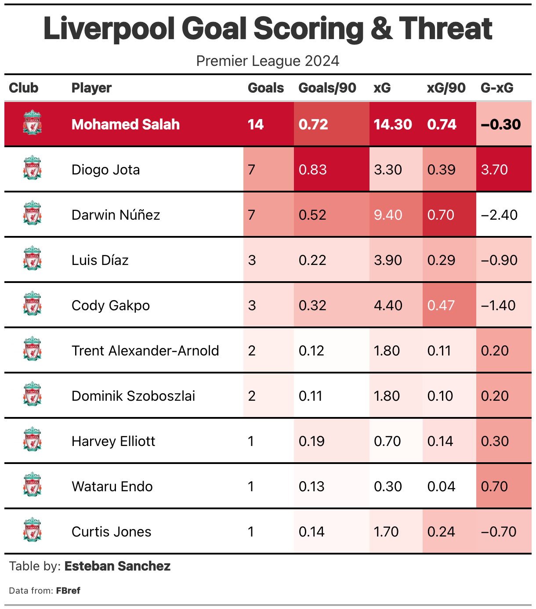
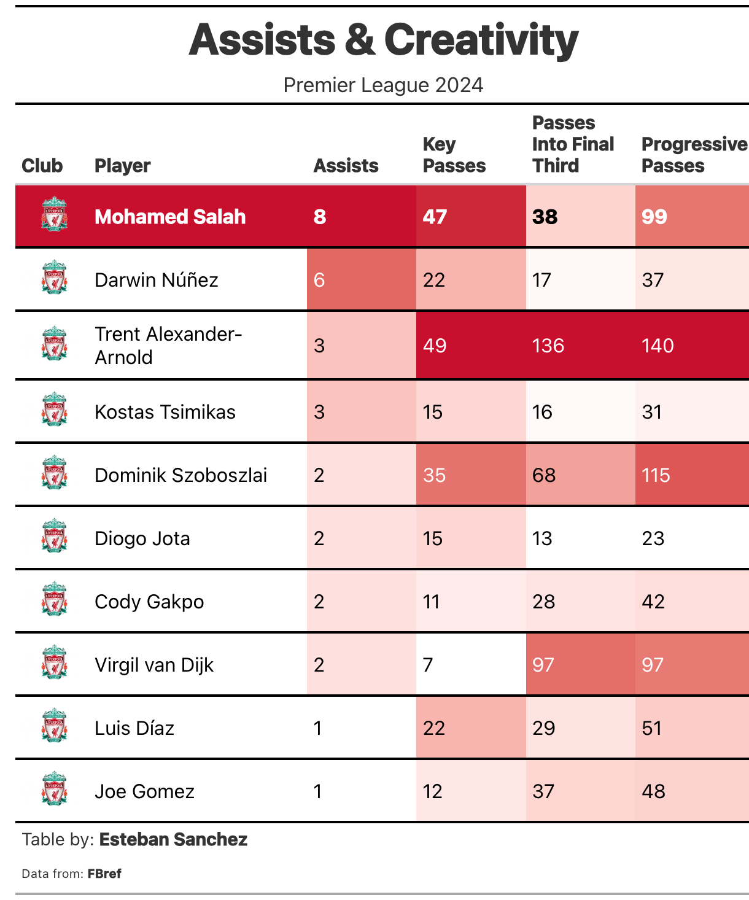
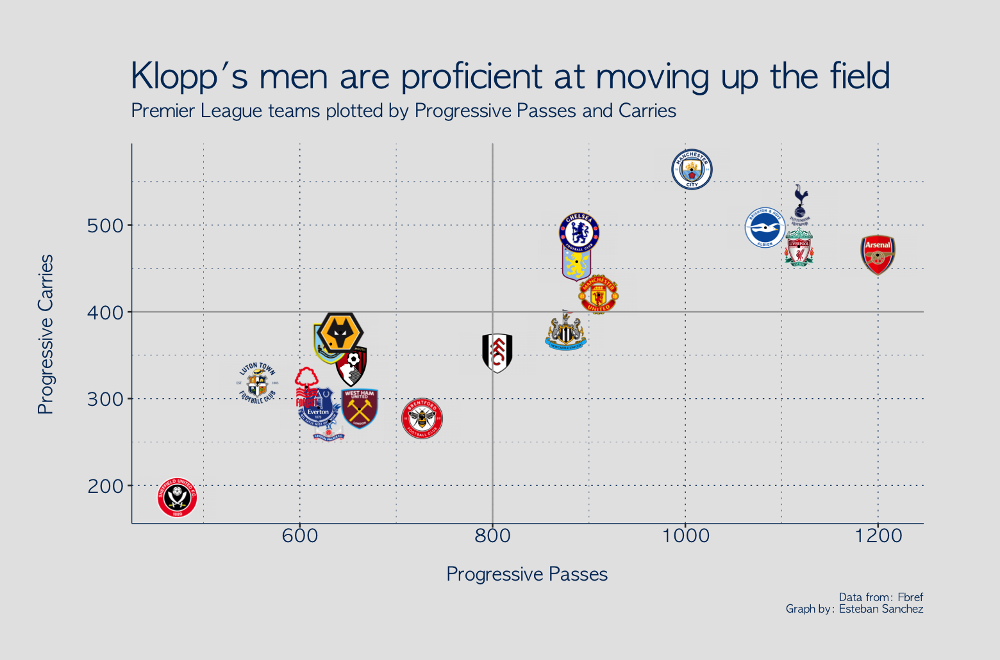
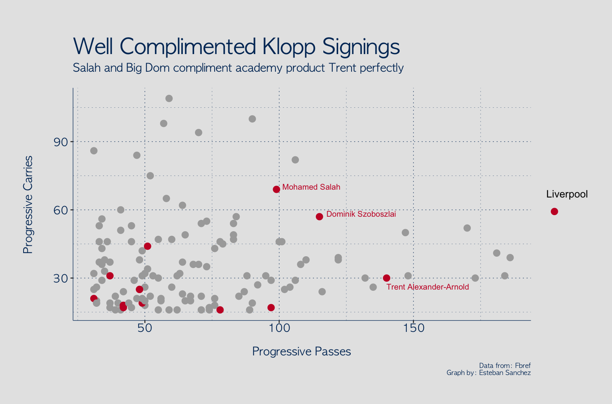

# Reflecting on Klopp's Final Season at Liverpool
### A Statistical Farewell to the Man Who Changed Everything

**January 2024** — Jurgen Klopp announced he will be leaving Liverpool at the end of the season. It hit different. Even as a Spurs fan, you have to respect what he built at Anfield.

So this feels like the right time to reflect on what we now know is his final season in charge. What does this Liverpool team look like under the hood? Who's driving the machine? And can they send him off with one more title?

---

## The Goal Threat: Salah, Jota, and... Núñez

Arguably the greatest gift Klopp brought to Liverpool (second only to that Champions League trophy, of course) was **Mohamed Salah**. And in his final season, Mo proves he's still their most dangerous player.

But the data reveals some interesting subplots:

- **Salah** — Still the king. Goals, threat, everything you'd expect.
- **Diogo Jota** — The underrated one. He's been quietly *overperforming* his xG more than anyone else in the squad. Clinical when it matters.
- **Darwin Núñez** — No surprises here. The least clinical of the attacking options. The talent is there, the finishing... less so.

The numbers paint a clear picture: Salah remains the heartbeat of this attack, Jota is doing more than he gets credit for, and Núñez is still a work in progress.

---

## The Creative Engine: Salah Scores *and* Creates

What makes Salah truly elite isn't just his goalscoring, it's that he's creating chances too. He leads the team in assists.

But here's the thing: the *real* creative force isn't a forward at all.

**Trent Alexander-Arnold** is the engine that propels Liverpool upfield. Look at the numbers:
- Key Passes
- Passes into the Final Third
- Progressive Passes

Trent leads or rivals the top in every category. From right-back. The man is a cheat code for ball progression.

Salah may get the headlines, but Trent is the one making it all tick.

---

## The Bigger Picture: Liverpool in the Premier League

Zooming out to look at the entire league, Liverpool's attacking profile becomes even more impressive. They combine **intricate passing sequences** with **individual brilliance**, the best of both worlds.

When you plot Progressive Passes against Progressive Carries for every team in the Premier League, Liverpool sit comfortably in the upper-right quadrant (solid lines are league averages). They're not just hoofing it forward or relying on one player to dribble through everyone. They do both, systematically.

The Premier League is an entertaining league. Klopp's men are a big reason why.

---

## Astute Signings: The Klopp Special

One of Klopp's defining characteristics has been his ability to identify and sign players who immediately elevate the team. Salah, obviously, is the crown jewel. But he's done it time and time again.

This season's example? **Dominik Szoboszlai**.

"Big Dom" has had an instant impact, slotting in perfectly alongside Salah and Trent. When you plot individual players by Progressive Passes and Progressive Carries, three Liverpool names stand out in the upper reaches:

- **Trent** — The passer, pulling strings from deep
- **Salah** — The carrier, driving at defenses
- **Szoboszlai** — The hybrid, doing both

They complement each other beautifully. Klopp found another one.

---

## The Send-Off He Deserves?

Without a doubt, Liverpool are a fascinating team to watch. The structure, the intensity, the individual quality, it's all there.

And look, I'll be honest: as a Spurs fan still nursing wounds from that FA Cup loss to Man City, I'm kind of rooting for Liverpool here. Guardiola has had his time. It would be poetic to see Klopp lift one more Premier League trophy on his way out.

Whether the numbers say they *should* win it is one thing. Whether the football gods give him the ending he deserves is another.

Either way, this Liverpool team, this Klopp team, has been a joy to analyze.

---

## Technical Details

**Data Source:** [FBref](https://fbref.com/) via `worldfootballR`

**Tools Used:**
- R: `worldfootballR`, `ggplot2`, `gt`, `gtExtras`, `ggimage`

**Written On:** January 30, 2024

---

*Written by a Spurs fan who respects greatness when he sees it.*
