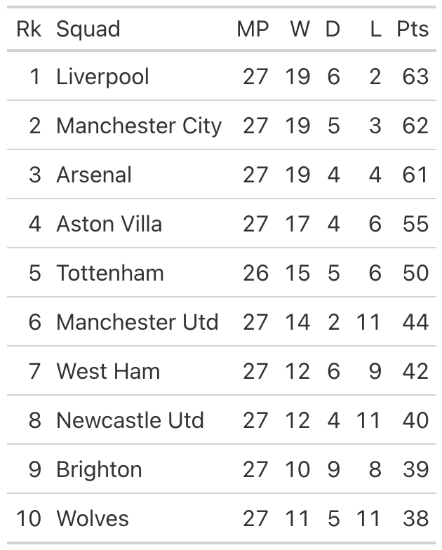
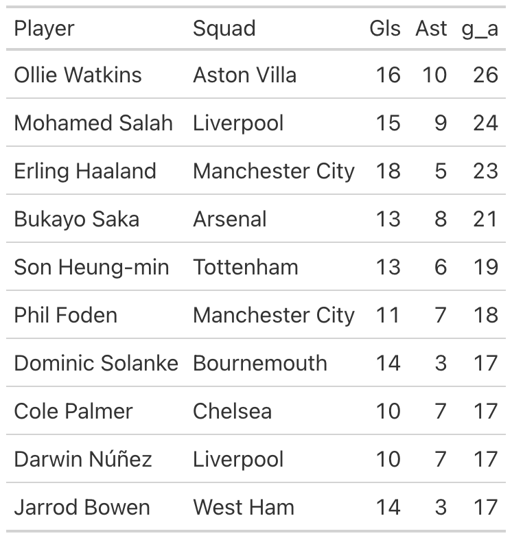
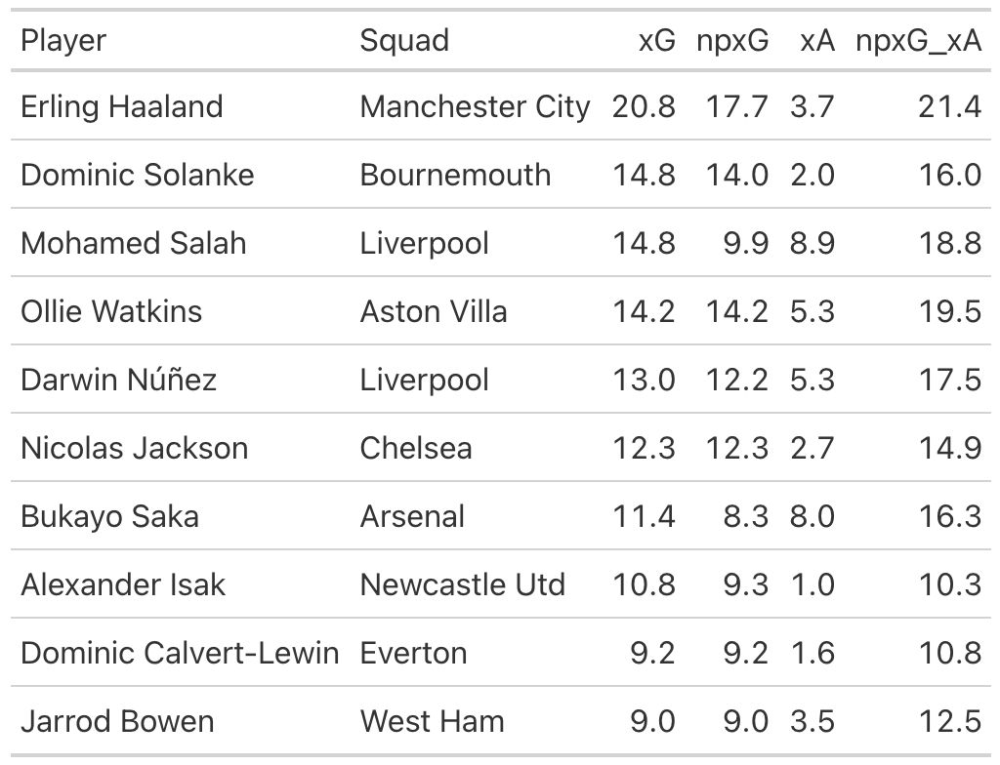
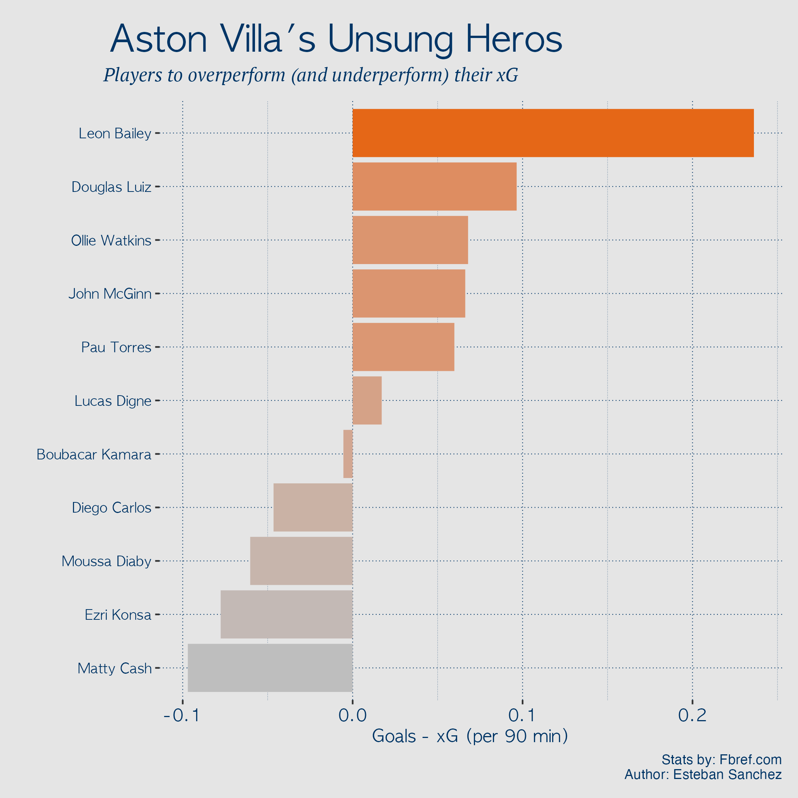
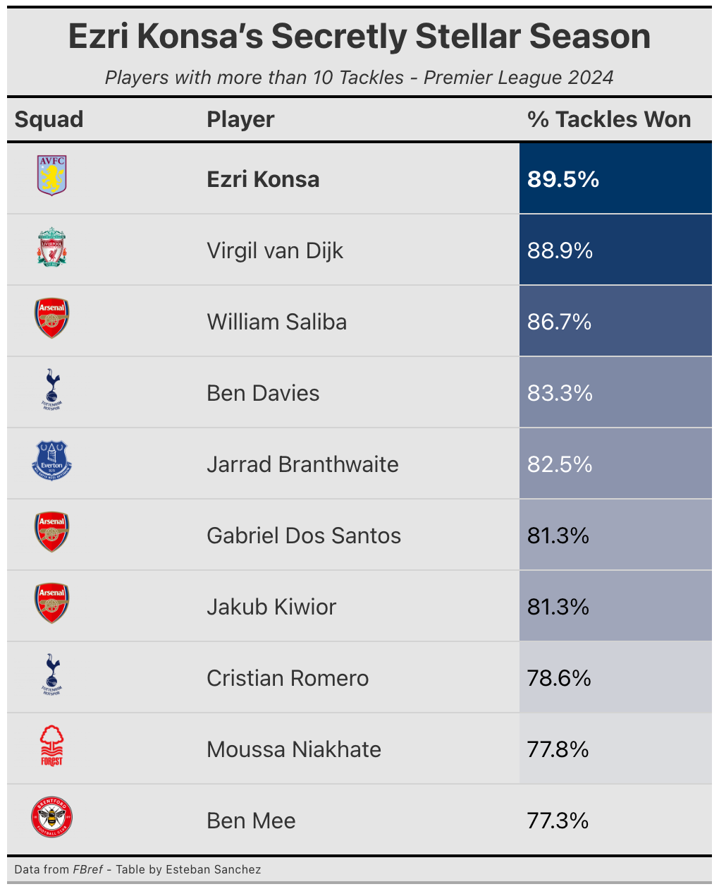
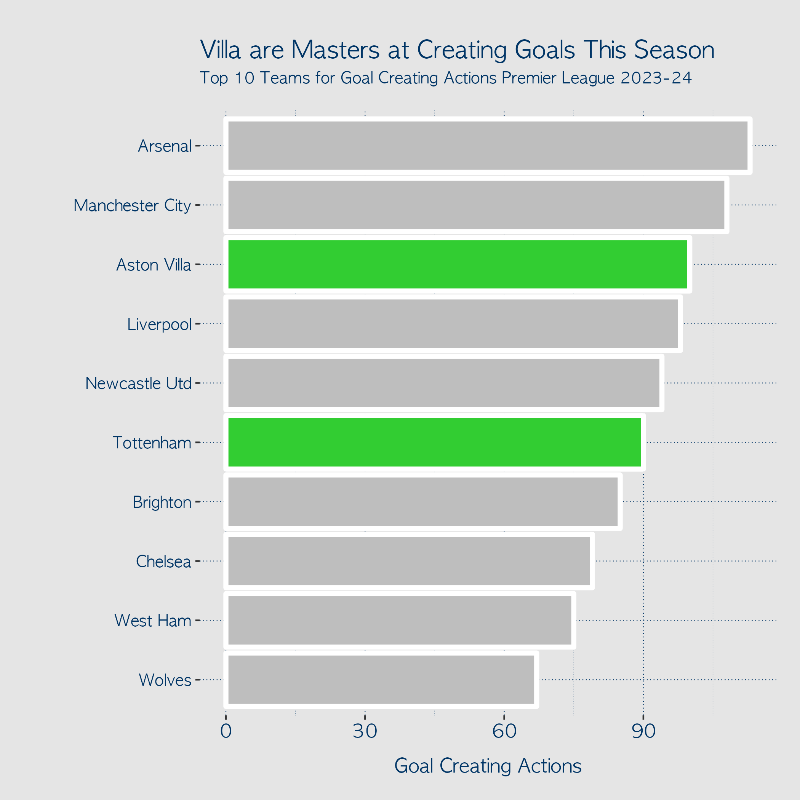
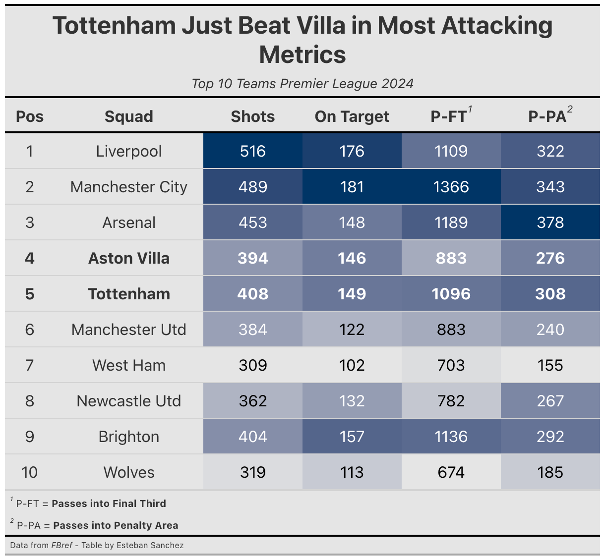
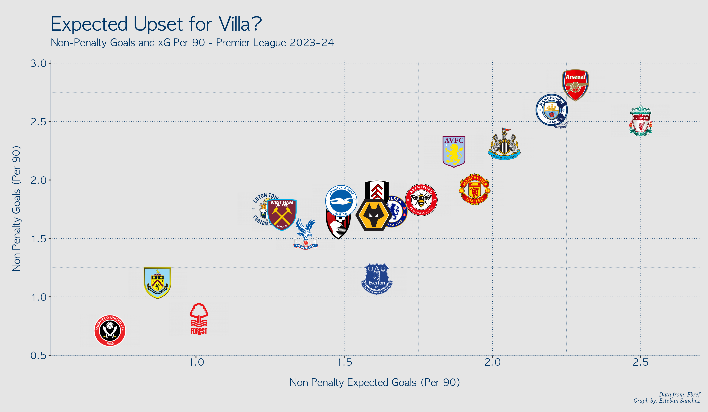

# Can Aston Villa Actually Pip Spurs to the Top 4?
### A Spurs Fan's Reluctant Deep Dive

**March 2024** — With a crucial head-to-head looming at Villa Park, I decided to do what any anxious football fan would do: obsessively analyze the opposition to convince myself my team will be fine.

As a Spurs supporter, the question haunting me is simple: *Is this Aston Villa team actually good, or are they just having a moment?*

Let's find out.

---

## Setting the Scene

Both teams have had their ups and downs this season, injuries to key players, inexplicable off-days, the usual Premier League chaos. But here we are, both fighting for that coveted 4th Champions League spot.

A quick glance at the table:

Five points separate us. One game in hand for Spurs. Everything to play for.

---

## Is Watkins Better Than Haaland?

Let's start with a hot take.

Ollie Watkins has been **the** standout performer for Villa this season, contributing 26 goals and assists, *more than any other player in the division*. More than Haaland. More than Salah. More than anyone.

But is he actually better than Haaland? The raw numbers say yes. The underlying data says... not so fast.

### Looking Under the Hood

Despite missing two months to injury, Haaland still sits **top of the league for Expected Goals**. Watkins? Fourth.

The picture becomes clearer when you dig into the numbers:

- **Watkins is overperforming his xG** — he's been clinical, finishing chances he "shouldn't" score
- **Haaland is underperforming** — his goals will come
- **The real story is assists** — Watkins is overachieving his Expected Assists by *more than double*

That last point is crucial. Watkins is putting teammates in decent positions, but they're converting at an unsustainable rate. His assist numbers are inflated by his teammates' hot streaks.

*Quick shoutout to Cole Palmer, who's nowhere in the xG tables but sits among the top 10 for actual output. That kid is special.*

---

## Villa's Unsung Heroes

If Watkins' teammates are overperforming, who exactly are they?

I looked at every Villa player with 1000+ minutes and compared their actual goals to expected goals (per 90 minutes):

**Leon Bailey** and **Douglas Luiz** lead the charts. At Bailey's current rate, he's scoring an *extra* goal every four games beyond what the chances suggest he should.

These are the players making Watkins look like an assist machine. And it explains why Villa sit 4th—they're converting at a rate that, statistically speaking, probably won't last.

---

## The Foundation Emery Built

Not everyone can be a goalscorer. What Villa have is a rock-solid foundation, and three players deserve special recognition:

### Ezri Konsa — The Composed Defender

Konsa has been outstanding. He's:
- **Top 15** in the league for Pass Completion %
- **#1 in the league** for Tackle Success Rate (among players with 10+ tackles)

He helps Villa play out from the back with control, but when he needs to step in defensively, he wins the ball **89.5% of the time**. That's elite.

### John McGinn — The Motor

The captain leads by example. You love playing with him; you hate playing against him. Every time I see McGinn sprinting full throttle at an opponent, I fear for their safety.

His "hustle stats" are ridiculous:
- **Top 10** for tackles in the middle third
- **Top 20** for Goal Creating Actions
- **13th** for passes into the final third
- **9th** for live ball passes leading to shot attempts

Maybe he deserves more assists for the season he's having. He doesn't seem to care.

### Douglas Luiz — The Box Crasher

We already saw Luiz overperforming his xG. He's also Villa's designated penalty taker—*over Watkins*—and ranks in the **top 20 for passes into the penalty area**.

What the stats don't capture is how often he crashes the box for rebounds. That nose for goal explains his numbers this season.

---

## Villa vs. Spurs: The Direct Comparison

Now for the question I've been avoiding. How do we actually stack up?

### Goal Creating Actions

This one hurts to admit: **Villa are above Spurs for Goal Creating Actions**. They're even above Liverpool (barely). At the end of the day, GCAs are what win games. This is Villa's strongest argument for the top 4.

### Other Attacking Metrics

But zoom out to broader attacking stats, and Spurs edge ahead:

Spurs have more shots, more shots on target, more passes into the final third, more passes into the penalty area. The volume is there.

The counterargument? Volume means nothing if you can't create actual goal-scoring moments. Villa are more *efficient* with their attacks.

---

## Expected Upset (xU)?

Here's where it gets interesting.

Non-Penalty Expected Goals vs. Actual Goals tells you which teams are sustainable and which are riding luck:

- **Liverpool** — Performing almost exactly as expected
- **Arsenal & Man City** — Slightly overperforming
- **Tottenham** — *Underperforming* their xG (looking at you, Timo Werner)
- **Aston Villa** — *Overperforming* their xG

Spurs fans can take hope: the chances are there, the conversions will come.

Villa fans should worry: the goals have come, but the chances suggest regression.

---

## The Verdict

After all this analysis, where do I land?

**I respect Aston Villa.** The players, the system, Emery's work, it's genuinely impressive. Both clubs are in the early stages of exciting projects, and both have exceeded expectations.

But here's the thing: Villa's foundation is built on an ageing McGinn and a Douglas Luiz having his first truly excellent season. The overperformance across the squad suggests they're running hot at exactly the right time—but that heat may not last through the run-in.

Spurs have the underlying numbers. The chance creation is there. If the finishing clicks (*please, someone other than Son start scoring*), Tottenham should be playing Champions League football next season.

**My prediction:** Spurs clinch 4th. But I'll be nervous until the math makes it impossible for Villa to catch us.

---

## Technical Details

**Data Source:** [FBref](https://fbref.com/) via `worldfootballR`

**Tools Used:**
- R: `worldfootballR`, `tidyverse`, `ggplot2`, `gt`, `gtExtras`

**Analysis Date:** March 9, 2024 (before Spurs vs Villa)

**Outcome:** *[Spoiler: You'll have to check the final table to see who was right]*

---

*Written with equal parts data analysis and Spurs-induced anxiety.*
