# Is Emiliano Martínez Actually Good at Saving Penalties?
### A Data-Driven Hate Piece

**What separates a saved penalty from an unsaveable one? And does the so-called "penalty god" actually deserve his reputation?**

In football, few moments carry as much weight as a penalty kick. The 12-yard spot. The goalkeeper. The silence before the whistle. But beneath the drama lies a question begging for data: *are some penalty placements genuinely harder to save than others?*

I'll be honest about my motivation here. I don't particularly like Emiliano Martínez. The antics, the dancing, the psychological warfare, it all rubs me the wrong way. But he's built a reputation as a "penalty god," and I wanted to see if the data actually supports that. Is he truly elite at *saving* penalties, or is something else going on?

Using StatsBomb's open data, I set out to answer this by analyzing **273 penalties on target** from major international tournaments: FIFA World Cup (2018, 2022), UEFA Euro (2020, 2024), and AFCON (2023).

---

## The Data: Penalties on Target

The first step was collecting every penalty that actually challenged the goalkeeper (shots on target, either saved or scored). Off-target penalties and those hitting the woodwork were excluded since they don't test the keeper.

```r
pens <- all_events %>% 
  filter(shot.type.name == "Penalty") %>% 
  select(shot.end_location.y, shot.end_location.z, shot.outcome.name) %>% 
  filter(shot.outcome.name %in% c("Saved", "Goal"))
```

Here's what the raw distribution looks like:

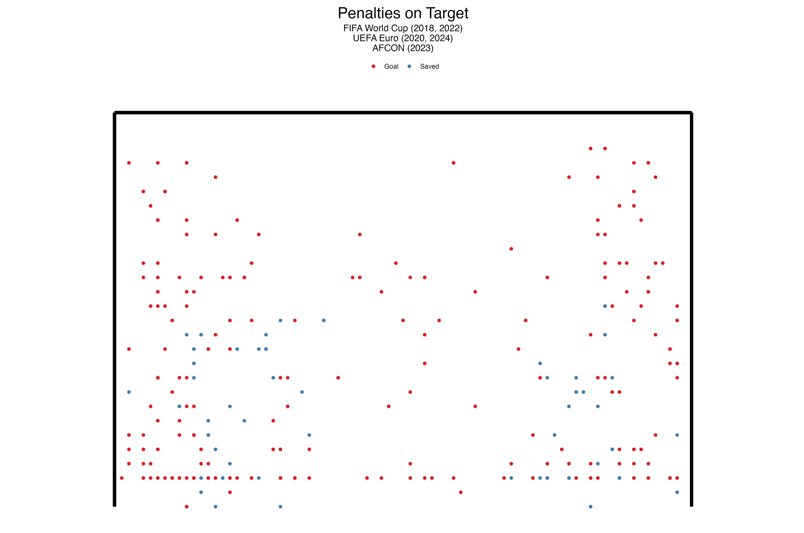

The scatter immediately reveals patterns. Goals cluster in certain areas, while saves seem to concentrate in others. But can we formalize this intuition?

---

## Clustering: Finding the Natural Zones

Rather than arbitrarily defining "good" and "bad" penalty zones, I used **K-means clustering** to let the data speak for itself. The algorithm grouped penalties based on their end location (Y = horizontal, Z = vertical).

Using the elbow method and silhouette scores, **4 clusters** emerged as the optimal grouping:

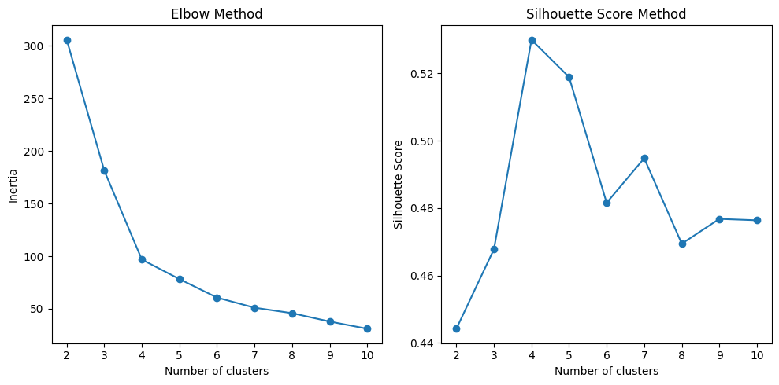

```python
optimal_k = 4
kmeans = KMeans(n_clusters=optimal_k, random_state=42)
cluster_labels = kmeans.fit_predict(df_scaled)
```

The resulting clusters:

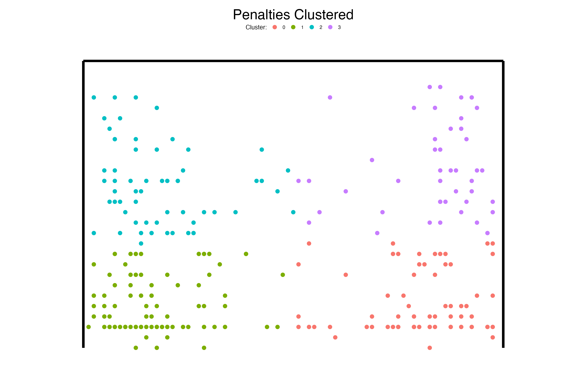

### Cluster Statistics

| Cluster | Center Y | Center Z | Save % |
|---------|----------|----------|--------|
| 0       | 42.44    | 0.41     | 31.5%  |
| 1       | 37.39    | 0.41     | 24.7%  |
| 2       | 37.45    | 1.57     | 20.9%  |
| 3       | 42.61    | 1.70     | **6.1%** |

The pattern is striking. **Cluster 3** (upper corners) has a mere 6% save rate—nearly unsaveable territory. The low corners (Clusters 0 and 1) hover around 25-31%, while Cluster 2 sits in between.

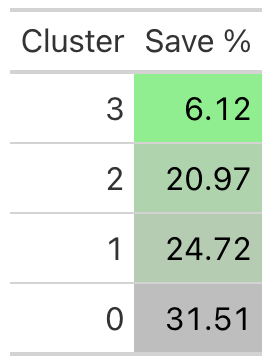

---

## Defining a "Good" Penalty

By analyzing each cluster individually, clear boundaries emerged:

### Cluster 0 (Right Side, Low)
Shots placed beyond x = 42.75 have significantly higher goal conversion rates.

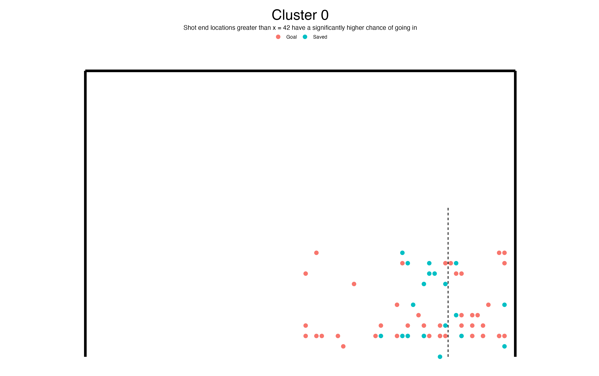

### Cluster 1 (Left Side, Low)
The mirror image—shots inside x = 37 beat keepers more often.

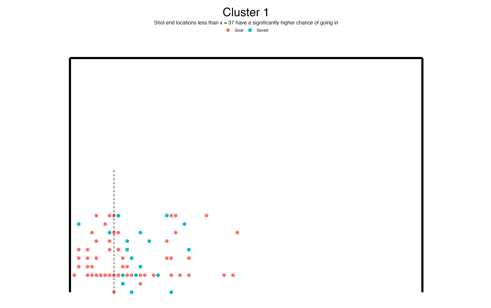

### Clusters 2 & 3 (Upper Zones)
Any shot above z = 1.35 meters dramatically reduces save probability.

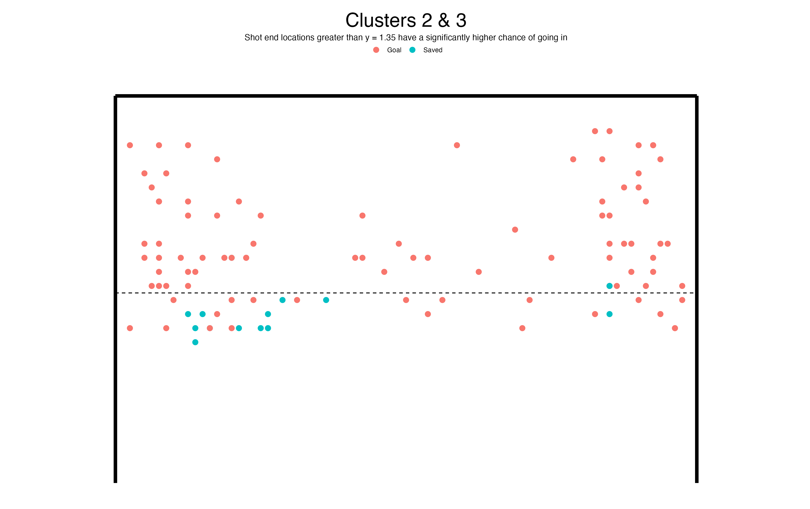

### The "Good Penalty Zone"

Combining these insights, a **good penalty** lands outside the central danger zone—either in the corners or elevated above 1.35m:

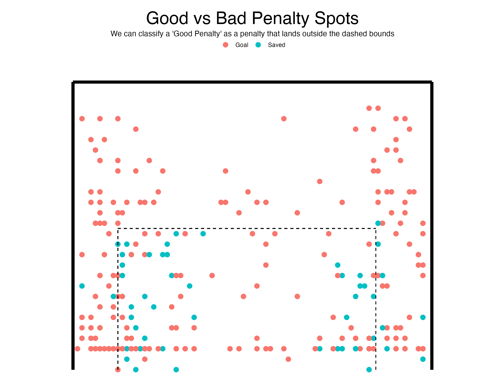

The dashed lines represent the "saveable zone." Penalties landing **outside** this box are classified as "good penalties", shots that give the goalkeeper minimal chance.

```r
good_penalty <- function(df){
  new_df <- df %>% 
    mutate(good_pen = case_when(
      shot.end_location.z >= 1.35 & shot.end_location.z < 2.7 ~ 1,  # High
      shot.end_location.y <= 37 ~ 1,    # Far left
      shot.end_location.y >= 42.75 ~ 1, # Far right
      TRUE ~ 0  # Center = bad penalty
    ))
  return(new_df)
}
```

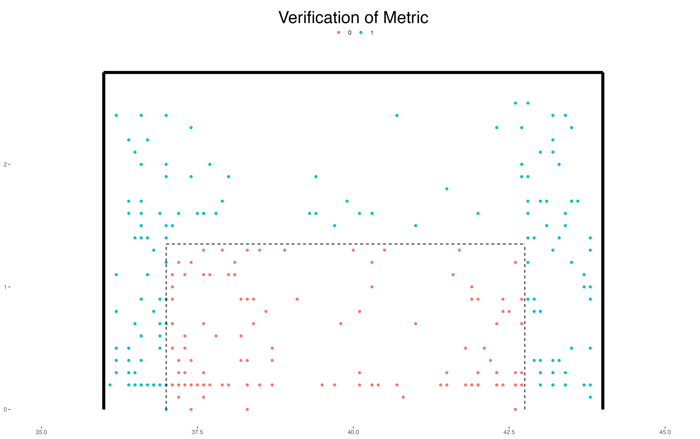

---

## Which Goalkeepers Beat the Odds?

With our metric defined, the real question becomes: **which keepers save penalties they shouldn't?**

I applied this framework to 21 top international goalkeepers:

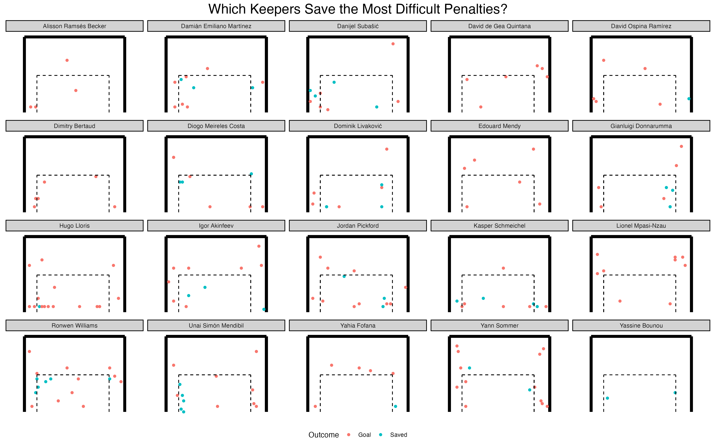

Some names immediately stand out. Keepers like **Dominik Livaković**, **Diogo Costa**, and **Emiliano Martínez** have made careers out of penalty heroics. But are they genuinely saving difficult shots, or facing weaker penalties?

### The Complete Picture

This combined view tells the full story, each goalkeeper's overall save rate, the difficulty of penalties they faced, and crucially, how they performed against well-placed shots:

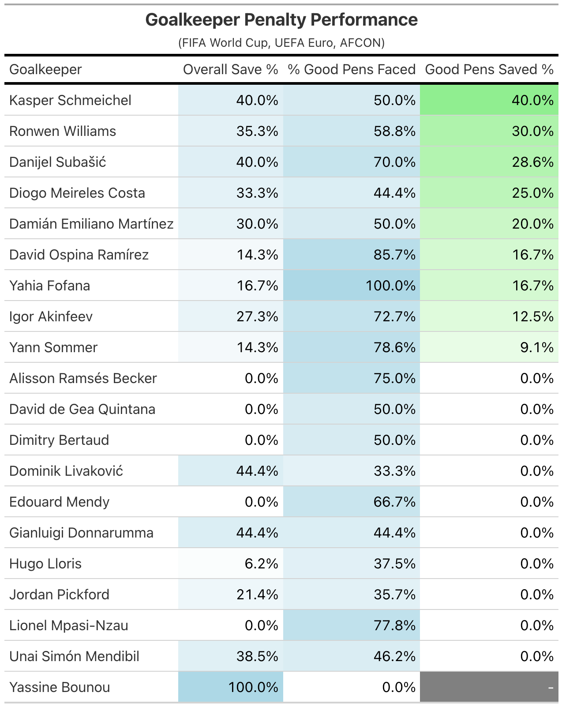

### The Emiliano Martínez Question

And here's where it gets interesting. Look at Martínez's numbers closely.

His overall save percentage? Impressive. But look at the **% of Good Penalties Faced**, it's not necesarily high, about half. Players facing Martínez consistently shoot into the most saveable zones of the goal. The dancing, the trash talk, the mind games, the delay tactics, fine, they work. But not because they help him dive better, but because they make penalty takers *worse* about half of the time. 

And okay fine I'll also give him this; his Good Penalties Saved % is also among the best in the game. Credit where it's due: the antics are clearly effective. But let's not pretend he's out there making superhuman saves. He's making average saves on below-average penalties.

---

## Key Takeaways

1. **Not all penalties are created equal.** Placement dramatically affects save probability—from 6% in the upper corners to 31% in the lower-right.

2. **The "good penalty zone" exists.** Shots placed below 1.35m and between y = 37-42.75 are significantly more saveable.

3. **Goalkeeper reputation needs context.** A keeper's save percentage means little without understanding the *quality* of penalties faced. Some "great" penalty stoppers are actually just great at making opponents choke.

4. **Upper corners are nearly unsaveable.** Cluster 3 (high shots) had a 94% conversion rate—if you can place it there, you'll likely score.

5. **Emiliano Martínez is a con artist** (sort of). His penalty "heroics" are built on psychology, not reflexes. The data suggests he faces easier penalties than his peers—his real talent is intimidation. Effective? Yes. Elite shot-stopping? The numbers say no.

---

## Technical Details

**Data Source:** [StatsBomb Open Data](https://github.com/statsbomb/open-data)

**Tools Used:**
- R: `StatsBombR`, `tidyverse`, `gt` for data collection, wrangling, and tables
- Python: `scikit-learn` for K-means clustering, `pandas`, `matplotlib`

**Competitions Analyzed:**
- FIFA World Cup (2018, 2022)
- UEFA Euro (2020, 2024)  
- Africa Cup of Nations (2023)

**Sample Size:** 273 penalties on target

---

*Analysis completed July 2024*
